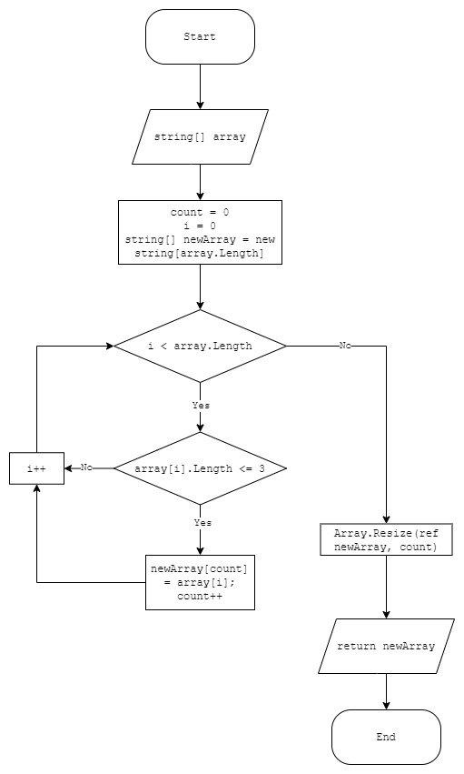

## Итоговая проверочная работа
___

### Задача: Написать программу, которая из имеющегося массива строк формирует новый массив из строк, длина которых меньше, либо равна 3 символам. Первоначальный массив можно ввести с клавиатуры, либо задать на старте выполнения алгоритма. При решении не рекомендуется пользоваться коллекциями, лучше обойтись исключительно массивами.
___
~~~
Примеры:
[“Hello”, “2”, “world”, “:-)”] > [“2”, “:-)”]
[“1234”, “1567”, “-2”, “computer science”] > [“-2”]
[“Russia”, “Denmark”, “Kazan”] > []
~~~
## Решение:
### 1. В метод передается массив строк. По его размеру (array.Length) создается новый пустой массив, инициализируется счетчик

### 2. В цикле сравниваем рамер каждого элемента массива с нужным числом (в нашем случае 3) если меньше или равен копируем в новый массив и увеличиваем счетчик
 
### 3. Усекаем размер нового массива по размеру счетчика (Array.Resize())
 
### 4. возвращаем новый массив
 
